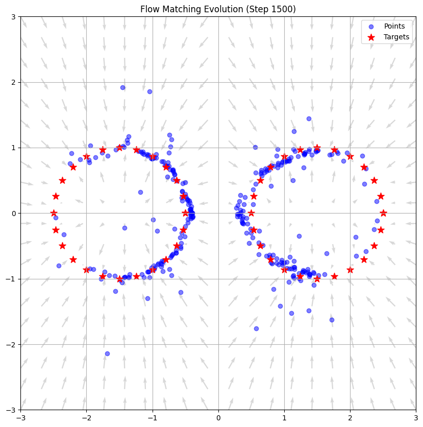
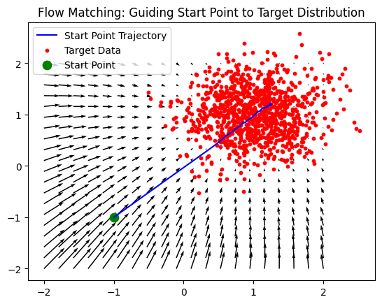

# Flow Matching for Robotics

This repository contains code for implementing Flow Matching to generate continuous data for robotics applications. It demonstrates how to smoothly transform noise distributions into complex target distributions, such as robot actions.

## Contents

- `src/`: Source code for training and evaluating the Flow Matching model.
- `notebooks/`: Jupyter notebooks for interactive demonstrations.
<!-- - `data/`: Dataset used for training and evaluation. -->
- `images/`: Images and animations generated by the model.
- `requirements.txt`: List of dependencies.



## Getting Started

### Prerequisites

- Python 3.7 or higher
- PyTorch
- NumPy
- Matplotlib
- tqdm
- Pillow

### Installation

Clone the repository:

```bash
git clone https://github.com/yourusername/flow-matching-robotics.git
cd flow-matching-robotics
```

Install the required dependencies:

```bash
pip install -r requirements.txt
```

### Usage
Run the main script to train the Flow Matching model:

```bash
python src/main.py
```


